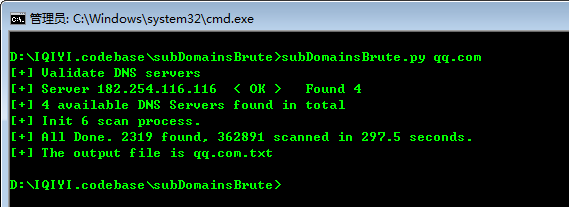

subDomainsBrute 1.1
======

快速pentesters子域的工具

本工具用于渗透测试目标域名收集。高并发DNS暴力枚举，发现其他工具无法探测到的域名, 如Google，aizhan，fofa。

## Change Log （更新日志）
* [2018-02-06] 
	* 添加多进程支持。 多进程 + 协程，提升扫描效率。 
	* 预处理了原字典中的占位符，提升扫描效率
* [2017-06-03] Bug fix: normal_lines remove deep copy issus, thanks @BlueIce
* [2017-05-04] 使用协程替代多线程； 使用了优化级队列，来减小队列的长度； 优化占位符支持

## Dependencies （依赖关系） ##
> pip install dnspython gevent

## Usage （用法）##
	Usage（用法）: subDomainsBrute.py [options（选项）] target.com
	Options（选项）:
	  --version             show program's version number and exit（显示程序的版本号和退出）
	  -h, --help            show this help message and exit（显示此帮助消息并退出）
	  -f FILE               File contains new line delimited subs, default is subnames.txt （文件包含新行分隔的子字符串，默认为subnames.txt）
	  --full                Full scan, NAMES FILE subnames_full.txt will be used to brute （全扫描名称文件 subnames_full.txt将被使用野蛮）
	  -i, --ignore-intranet Ignore domains pointed to private IPs（忽略指向私有IPS的域）
	  
	  -t THREADS, --threads=THREADS Num of scan threads, 200 by default（扫描线程的Num，默认为200）
	  -p PROCESS, --process=PROCESS
	                        Num of scan Process, 6 by default（扫描过程的Num，默认为6）
	  -o OUTPUT, --output=OUTPUT
	                        Output file name. default is {target}.txt（输出文件名。默认值是{target}.txt）

## Screenshot（截图） ##

如图，使用默认字典，扫描qq.com，发现去重后域名2319个，耗时约298秒。

Output could be like（输出可以像）: [https://github.com/LTF1633242320/subDomainsBrute/blob/master/dict/sample_qq.com.txt](https://github.com/LTF1633242320/subDomainsBrute/blob/master/dict/sample_qq.com.txt)

